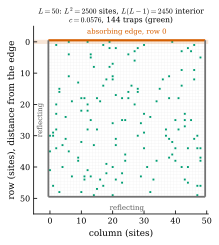
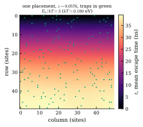
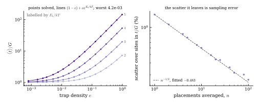
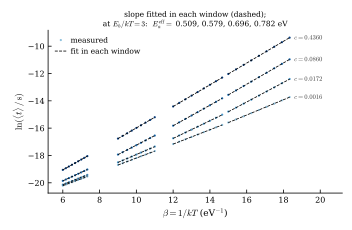
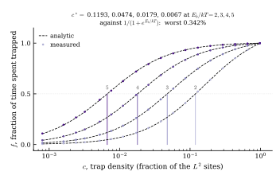

# Defect diffusion as a Markov process

A 2D lattice model of trap-limited defect diffusion, solved as an absorbing Markov chain for
mean escape times and the effective activation energy, used to measure how the effective
activation energy crosses over from the migration barrier to the trap-limited value as trap
density rises. Symbols and their values in [symbols.txt](symbols.txt).

## The problem

A defect crosses a crystal by thermally activated jumps between neighbouring sites. Adding
traps, sites that bind it more tightly, raises the time to reach an absorbing edge by orders of
magnitude without changing the route: escape from a site is isotropic whether that site binds or
not, so a trap delays a defect and never deflects one. Measuring how that time varies with
temperature gives the hopping barrier plus a share of the trap binding energy, and the share
grows with the trap density.

This project models the lattice as an absorbing Markov chain, solves its fundamental matrix for
the mean escape time from every site, and locates the trap density at which the effective
activation energy crosses from the migration barrier to the trap-limited value.

## The system

<p align="center">

</p>

Defects hop on an $L \times L$ lattice, $L = 50$. Row 0 is an absorbing edge and the other three
sides reflect, so the far row is a mirror and the lattice is half of a symmetric system $2L-1$
rows across. Each of the $L(L-1) = 2450$ interior sites is a state $S_i$, each jump an arrow to
a neighbour, and row 0 is the single absorbing state $S_0$. A fraction $c$ of sites are traps,
drawn without replacement so each has marginal probability $c$, swept over 18 logarithmic points
from $8 \times 10^{-4}$ to $0.98$. Leaving an ordinary site costs $E_{mig} = 0.5$ eV, a trap
$E_{mig} + E_b$ with $E_b = 0.3$ eV, at attempt frequency $\nu = 10^{13}$ s⁻¹. Temperature
enters only as $E_b/kT$, over $\lbrace 2, 3, 4, 5 \rbrace$, so a trap holds a defect
$e^{E_b/kT}$ times longer than an ordinary site does: 7 times at one end of the sweep, 148 at
the other.

## Method

### `chain`: the transition matrix

The state after $n$ jumps is the site the defect occupies, and where it goes next depends on
that site alone: the barrier is set by its binding energy, the directions by its bonds. So

```math
\Pr\big(X_{n+1} = S_j \mid X_n = S_i,\, X_{n-1}, \ldots, X_0\big)
 = \Pr\big(X_{n+1} = S_j \mid X_n = S_i\big) = P_{ij}
```

and the process is carried by the single matrix $P$. Collect the occupation probabilities into a
row vector $\mathbf{p}_n$ with $(\mathbf{p}_n)_i = \Pr(X_n = S_i)$, and list the interior states
first:

```math
\mathbf{p}_{n+1} = \mathbf{p}_n P, \qquad
P = \begin{pmatrix} Q & \mathbf{a} \\ 0 & 1 \end{pmatrix}
```

where $Q$ is the interior-to-interior block and $\mathbf{a}$ the column of probabilities of
reaching $S_0$ on the next jump. The bottom row is $\Pr(X_{n+1} = S_0 \mid X_n = S_0) = 1$, so
the block beneath $Q$ is zero.

Escape is isotropic, so with $z_i$ the coordination of site $i$, 4 in the bulk, 3 on an edge and
2 in a corner,

```math
Q_{ij} = \frac{1}{z_i} \;\text{ for } j \text{ a neighbour of } i, \qquad Q_{ij} = 0 \;\text{ otherwise}
```

Bonds running into row 0 leave $Q$ and become entries of $\mathbf{a}$, so every row closes on 1.
On a $3 \times 3$ lattice the interior states $S_1, \ldots, S_6$ are the sites
$(1,0), (1,1), (1,2), (2,0), (2,1), (2,2)$ with $z = 3, 4, 3, 2, 3, 2$:

```math
Q=\begin{pmatrix}
0 & \tfrac{1}{3} & 0 & \tfrac{1}{3} & 0 & 0 \\
\tfrac{1}{4} & 0 & \tfrac{1}{4} & 0 & \tfrac{1}{4} & 0 \\
0 & \tfrac{1}{3} & 0 & 0 & 0 & \tfrac{1}{3} \\
\tfrac{1}{2} & 0 & 0 & 0 & \tfrac{1}{2} & 0 \\
0 & \tfrac{1}{3} & 0 & \tfrac{1}{3} & 0 & \tfrac{1}{3} \\
0 & 0 & \tfrac{1}{2} & 0 & \tfrac{1}{2} & 0
\end{pmatrix},
\qquad
\mathbf{a}=\begin{pmatrix}
\tfrac{1}{3} \\ \tfrac{1}{4} \\ \tfrac{1}{3} \\ 0 \\ 0 \\ 0
\end{pmatrix}
```

Only $S_1, S_2, S_3$ neighbour row 0, hence three non-zero entries in $\mathbf{a}$.

Each of the $z_i$ bonds is attempted at frequency $\nu$ and cleared with probability
$e^{-E_{a,i}/kT}$, so the escape rate is $z_i \nu e^{-E_{a,i}/kT}$ and its reciprocal is the
mean wait,

```math
\tau_i = \frac{e^{E_{a,i}/kT}}{z_i \nu}
```

with $E_{a,i} = E_{mig}$ on an ordinary site and $E_{mig} + E_b$ on a trap. Return $Q$,
$\mathbf{a}$ and $\tau$. Only $\tau$ carries a trap; $Q$ is assembled from coordination alone.

### `escape`: the fundamental matrix

Let $A = \min\{n : X_n = S_0\}$ be the jump on which the defect is absorbed. The escape time is
the sum of the waits along the path, and the quantity wanted is its expectation from each state,

```math
T = \sum_{k=0}^{A-1} \tau_{X_k}, \qquad t_i = \mathbb{E}\big[T \mid X_0 = S_i\big]
```

Condition on the first jump,

```math
t_i = \tau_i + \sum_j Q_{ij}\, t_j
```

the sum over interior states only, since a jump to $S_0$ ends the walk. Gathered into a vector,

```math
(I - Q)\,t = \tau, \qquad t = N\tau, \qquad N = (I - Q)^{-1}
```

$(I - Q)$ inverts because absorption is certain: every interior state has a path out, so
$Q^n \to 0$ and $N = \sum_{n \ge 0} Q^n$. Its entries are

```math
N_{ij} = \mathbb{E}\Big[\textstyle\sum_{n \lt A} \mathbf{1}\{X_n = S_j\} \;\Big|\; X_0 = S_i\Big]
```

where $\mathbf{1}\{\cdot\}$ is 1 when its condition holds and 0 otherwise, so the sum counts
visits to $S_j$ before absorption and $N_{ij}$ is the mean number of them. Then $t = N\tau$ is
time-per-visit summed over visits, and only the mean of each wait enters. $N$ is dense and never
formed; $(I - Q)$ is sparse and factorised once with `scipy.sparse.linalg.splu`, and since $Q$
holds no trap and no temperature that one factorisation serves every density, temperature and
arrangement.

A uniform activation energy gives a closed form. Then $\tau_i = \tau_0 / z_i$ with
$\tau_0 = e^{E_{mig}/kT}/\nu$, so $z_i \tau_i$ is constant. Multiply the recursion by $z_i$ to
get $z_i t_i = \tau_0 + \sum_{j \sim i} t_j$, the sum running over the neighbours of $i$, and
since $z_i t_i$ counts $t_i$ once per bond,

```math
\sum_{j \sim i} (t_j - t_i) = -\tau_0 \qquad \Longrightarrow \qquad t(r) = \tfrac{1}{2}\,\tau_0\, r\,(2L - 1 - r)
```

a discrete Poisson equation on the lattice graph, with $t = 0$ on row 0 as the absorbing
boundary and a missing bond on a reflecting side imposing zero flux. Its solution depends on the
row $r$ alone.

### `disorder`: averaging over placements

The arrangement of traps is random, so a second expectation sits outside the one in $t_i$:
$\mathbb{E}_{\text{paths}}$ averages over walks at a fixed arrangement,
$\mathbb{E}_{\text{traps}}$ over the arrangements.

```math
\langle t_i \rangle = \mathbb{E}_{\text{traps}}\,\mathbb{E}_{\text{paths}}\big[T \mid X_0 = S_i\big]
```

The two commute because $t$ is linear in $\tau$, so the outer expectation passes through $N$ and
lands on $\tau$ alone. Site $j$ is a trap with marginal probability $c$, so

```math
\langle \tau_j \rangle = \Big[(1-c) + c\,e^{E_b/kT}\Big]\,\frac{e^{E_{mig}/kT}}{z_j \nu}
```

and that bracket is the same at every site, so it leaves the sum:

```math
\langle t_i \rangle = \Big[(1-c) + c\,e^{E_b/kT}\Big]
                      \sum_j N_{ij}\, \frac{e^{E_{mig}/kT}}{z_j \nu}
```

where the sum is the geometry factor $G$, one value per starting site, free of $c$ and $E_b$ and
equal to the trap-free escape time at the same $kT$.

### `measure`: the effective activation energy

Take logs, with $\beta = 1/kT$ and $G$ depending on $\beta$ only through $e^{\beta E_{mig}}$,

```math
\ln\langle t_i \rangle = \beta E_{mig}
                     + \ln\!\Big[(1-c) + c\,e^{\beta E_b}\Big] + \mathrm{const}_i,
\qquad \mathrm{const}_i = \ln \sum_j \frac{N_{ij}}{z_j \nu}
```

$\mathrm{const}_i$ carries no $\beta$, so every site gives the same slope and so does their
average. Differentiate,

```math
E_a^{\mathrm{eff}} = \frac{\mathrm{d}\ln\langle t \rangle}{\mathrm{d}\beta} = E_{mig} + E_b f, \qquad
f = \frac{c\,e^{\beta E_b}}{(1-c) + c\,e^{\beta E_b}}
```

where $f$ is the fraction of time spent trapped. Setting $f = 1/2$ gives the crossover density,

```math
c^{\ast} = \frac{1}{1 + e^{E_b/kT}}
```

Fit the slope over a window of $\pm 10\%$ in $\beta$ about each $E_b/kT$, narrow enough that the
fit returns the derivative at its centre, and read $c^{\ast}$ in the coordinate where the
relation is exactly straight, $\mathrm{logit}(f) = \mathrm{logit}(c) + E_b/kT$.

## The escape time field

<p align="center">

</p>

The axes are row and column in sites; colour is the mean escape time from that site in ns, for
one placement of the 144 traps, marked in green. Row 0 is the absorbing edge, drawn along the
top, and the colour bands run parallel to it: distance from that edge sets the escape time, and
almost nothing else does.

With no traps the field is exactly $\tfrac{1}{2}\tau_0\,r(2L-1-r)$, reproduced at all 2450 sites
to 9e-14: at $E_b/kT = 3$ a bulk site waits 3.71 ps between jumps and the far row sits at 18.2
ns. Traps lift this bodily by $(1-c) + c\,e^{E_b/kT}$, 2.10 at this density, and the row
averages of this one placement hold that lifted form to 2%. What is left drifts from $-0.4$% at
the absorbing edge to $+2$% at the far row, rather than scattering. $t_i = \sum_j N_{ij}\tau_j$
weights every site a defect visits before it escapes, not just its own. A defect starting far
from the edge crosses most of the lattice first, so a single trap lifts a whole region rather
than the site it sits on. That is why the green squares carry no colour of their own, and why
this arrangement, which happens to run trap-rich away from the edge, drifts upward with distance
instead of scattering site to site.

## The ratio $t/G$

<p align="center">

</p>

Both panels divide an escape time by $G$, the trap-free time at the same site and temperature.
If traps only rescale the clock, that ratio depends on $c$ and $E_b/kT$ alone.

The left panel tests that across the whole sweep, on log axes. Points are solved values of
$\langle t \rangle / G$ averaged over 400 placements; solid lines are $(1-c) + c\,e^{E_b/kT}$
with nothing fitted; the four pairs are labelled $2, 3, 4, 5$ at their right ends by $E_b/kT$,
light to dark. The ratio runs from 1 to 145 over three decades in $c$ and four temperatures, and
the worst departure anywhere on it is 4.2e-03. The entire effect of the traps is that one
bracket. Only the marginal probability enters it, never the joint distribution over placements:
the arrangement is free to be correlated. These traps are negatively correlated, a fixed number
drawn without replacement; clustered, positively-correlated traps are expected to fit just as
well.

The right panel is what that 4.2e-03 is made of. At a single placement the ratio still varies
site to site, by 1.55% at $c = 0.058$ and $E_b/kT = 3$: 144 traps are a small sample of the
region a defect visits before it leaves. Averaging $n$ placements before taking the ratio
shrinks that scatter as $n^{-1/2}$, the dashed reference line, fitted $-0.483$ over two decades
and reaching 0.170% at a hundred. This is sampling error about an exact answer, not a departure
from it. The batching is into disjoint groups, which is why it stops at $n = 100$, where four
independent groups still remain per point.

The route itself never moves. $Q$ comes out bit-identical for every placement, and for a crystal
with no traps at all: trapping only ever rescales a clock that geometry has already set.

## The Arrhenius slope and the crossover

<p align="center">


</p>

The left panel is the Arrhenius plot. $\ln\langle t \rangle$ against $\beta$ is straight within
each temperature window, one cluster of points per window, and the dashed line through each
cluster is the fit whose slope is $E_a^{\mathrm{eff}}$. Four trap densities are drawn, light to
dark and labelled by $c$ at their right ends. Raising the density lifts the slope from $E_{mig}$
towards $E_{mig} + E_b$: one migration mechanism reports different activation energies in
crystals differing only in how many traps they hold.

The right panel plots the measured $f$, extracted as $(E_a^{\mathrm{eff}} - E_{mig})/E_b$ from
those slopes, against $c$ on a log axis. Points are measured, the dashed curves are the analytic
$f$, each labelled $2, 3, 4, 5$ by $E_b/kT$ above the vertical line marking its own $c^{\ast}$.
The points lie on the curves at every density and every temperature, each crossing $f = 1/2$
where that line stands. The crossover moves left as binding strengthens relative to $kT$: a
deeper trap holds the defect longer, so fewer are needed to dominate the time budget. The dilute
limit is out of reach at the largest $E_b/kT$: the sparsest lattice swept holds two traps in
2500 sites, $c = 8 \times 10^{-4}$, and those two already carry 10.6% of the diffusion time.

$c^{\ast} = 0.0067$ at $E_b/kT = 5$: a trap detains the defect $e^{E_b/kT} = 148$ times longer
than an ordinary site, so one trap in $1 + 148$ sites accumulates as much waiting as the 148
around it. Below that density an Arrhenius plot returns $E_{mig} = 0.5$ eV; above it the slope
climbs towards $E_{mig} + E_b = 0.8$ eV, and the diffusion time rises by a factor of 130 across
the densities swept.

An Arrhenius measurement therefore mixes two things together: a migration barrier and a trap
population, indistinguishable from a single slope. An activation energy above $E_{mig}$ need not
mean a larger migration barrier; past the crossover the crystal is trap-limited, and the same
mechanism would report $E_{mig}$ in a cleaner sample. This is the assumption behind the trapping
models used for hydrogen in metals, where diffusivities measured on different samples of the
same metal disagree for exactly this reason. A diffusivity quoted without a trap density is not
yet a material property.

## Results

| | measured | independent | agreement |
|---|---|---|---|
| crossover $c^{\ast}$, four temperatures | 0.1193, 0.0474, 0.0179, 0.0067 | 0.1192, 0.0474, 0.0180, 0.0067 from $1/(1 + e^{E_b/kT})$ | **worst 0.342 %** |
| $E_a^{\mathrm{eff}}$, 4 temperatures x 18 densities | 72 fitted slopes | $E_{mig} + E_b f$ at each | worst 0.195 % |
| factorisation of $\langle t \rangle$ | $\langle t \rangle$ over 400 placements | $[(1-c) + c\,e^{E_b/kT}]\,G$ | 6.34e-04 |
| geometry factor $G$ | 24 values, 6 densities x 4 binding energies | the trap-free $G$ at the same $kT$ | worst 2.2e-15, or 10 $\varepsilon$ |
| jump chain $Q$ | $Q$ for three placements | assembled from $z_i$ alone | bit-identical |
| five closed forms | the sparse solve | 1D chain $t$, $N_{ij}$, $\tfrac{1}{2}\tau_0 r(2L{-}1{-}r)$, one trap, absorption certain | worst 1.1e-13 |
| $f$ inverted for $c$ | $f$ re-evaluated at the recovered $c$ | the targets, $f = 10^{-6}$ and $1 - 10^{-6}$ | 8.2e-11 |
| $c^{\ast}$ stability, two lattice sizes | range 0.444 % | 2450 and 4830 interior sites | $f$ moves 0.0028 |
| scatter in $t/G$ as placements are averaged | exponent $-0.483$ | $-1/2$ for a sampling law | 3.4 % |
| worst error against the closed forms | 1.1e-13 | float64 bound $\varepsilon\,\mathrm{cond}_1(I-Q)$ = 2.4e-12 | 22x inside the bound |

## Run

```
git clone https://github.com/kv2304/defect-diffusion-as-a-markov-process.git
cd defect-diffusion-as-a-markov-process
pip install -r requirements.txt
python diffusion.py     # ~4s, redraws figures/
```
